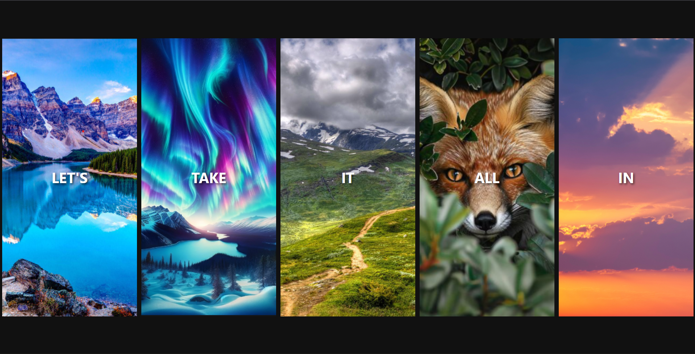

# Flex Panel Image Gallery

An interactive image gallery where panels expand when hover using CSS Flexbox animations.

## About

This is a responsive image gallery built using HTML, CSS (Flexbox), and JavaScript.  
Users can hover on any image panel to expand it while the others shrink, creating a smooth and interactive gallery effect.  
I built this project to practice Flexbox layouts, CSS transitions, and adding interactivity with JavaScript.

## Built With

`HTML` `CSS` `JavaScript` `Flexbox`

## What I Learned

- How to build responsive layouts using Flexbox and control animations and UI interactions with JavaScript and CSS transitions.

## Links

- [Live Demo](https://snehashrestha123.github.io/Flex-Panels-Image-Gallery/ )
- [Source Code](https://github.com/Snehashrestha123/Flex-Panels-Image-Gallery)
